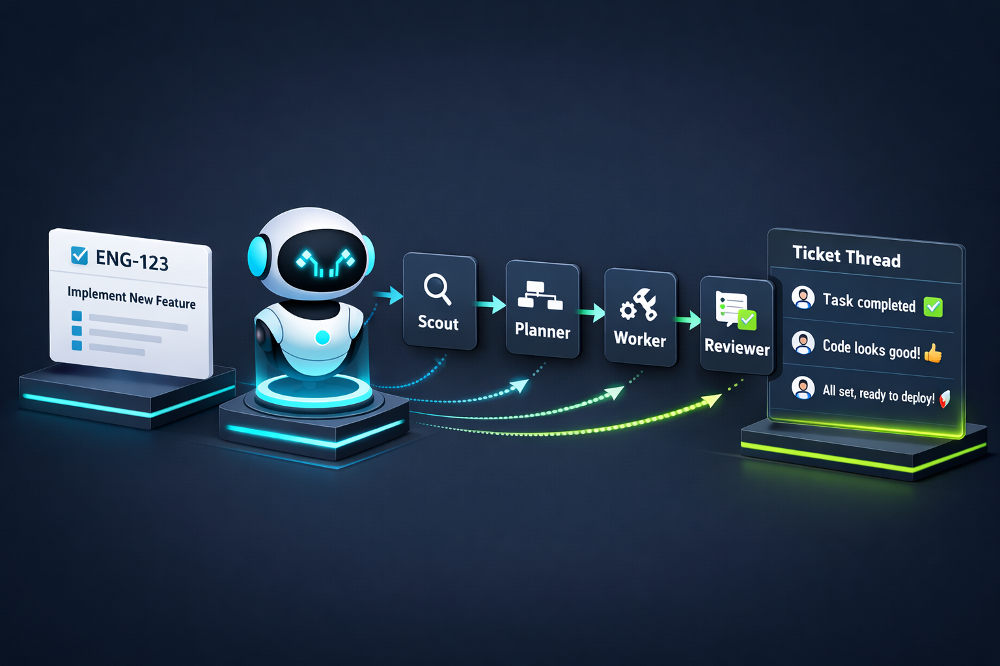

# pi Assemble Extension



A Linear-synced multi-agent orchestration extension for [pi](https://github.com/mariozechner/pi) — the AI coding agent.

This extension uses the Linear GraphQL API directly (no local CLI dependency is used).

Run a full `scout → planner → worker → reviewer` pipeline on any Linear ticket, with automatic progress updates posted as comments — all rendered with full native TUI output.

## Features

- **One-command assembly** — `/assemble ENG-123` kicks off the full workflow
- **Native UI rendering** — Each subagent runs with full live streaming, visible tool calls, and expandable output (Ctrl+O)
- **Linear progress tracking** — Each phase posts a comment to the Linear ticket via the `linear_comment` tool
- **Iterative refinement** — Worker/Reviewer loop runs up to 3 iterations
- **Prompt-driven** — Uses `sendUserMessage` to inject a structured prompt, letting the LLM orchestrate naturally via the `subagent` tool

## How It Works

The `/assemble` command does three things, then hands control to the LLM:

1. **Fetches** the Linear ticket (title, description, existing comments)
2. **Posts** an "Assembly Started" comment to Linear
3. **Sends a prompt** via `sendUserMessage` that instructs the LLM to run the pipeline

The LLM then calls the `subagent` tool naturally — the same way `prompts/implement.md` works — giving you full native TUI rendering for every phase.

```
/assemble ENG-123
  │
  ├─ Fetch ticket + comments from Linear
  ├─ Post "Assembly Started" comment
  ├─ Send prompt to LLM ──────────────────────┐
  │                                            │
  │   LLM orchestrates via subagent tool:      │
  │   ├─ chain: scout → planner                │
  │   │    └─ linear_comment (findings + plan) │
  │   ├─ loop (max 3):                         │
  │   │    ├─ single: worker                   │
  │   │    │    └─ linear_comment (impl)       │
  │   │    └─ single: reviewer                 │
  │   │         └─ linear_comment (verdict)    │
  │   └─ linear_comment (final summary)        │
  └────────────────────────────────────────────┘
```

## Requirements

1. **pi** — The AI coding agent (v0.52+)
2. **Linear API key** — Set `LINEAR_API_KEY` environment variable or add to `auth.json`:
   ```json
   {
     "linear": { "apiKey": "lin_api_..." }
   }
   ```
3. **Agents** — These must exist in `~/.pi/agent/agents/`:
   - `scout.md` — Investigation/analysis agent
   - `planner.md` — Implementation planning agent
   - `worker.md` — Code implementation agent
   - `reviewer.md` — Code review agent

## Installation

```bash
# 1. Clone or copy the extension
git clone https://github.com/nof0xgiven/assemble.git ~/.pi/agent/extensions/assemble

# 2. Ensure you have the required agents
ls ~/.pi/agent/agents/
# Should contain: scout.md, planner.md, worker.md, reviewer.md

# 3. Set your Linear API key
export LINEAR_API_KEY="lin_api_..."

# 4. Reload pi
/reload
```

## Usage

```bash
/assemble ENG-123
/assemble PROJ-456
```

## Tools

### `linear_comment`

Registered globally by the extension. The LLM calls this after each pipeline phase to post a progress comment to the Linear ticket.

| Parameter | Type | Description |
|-----------|------|-------------|
| `ticketId` | string | Linear ticket identifier (e.g. `ENG-123`) |
| `issueId` | string | Linear issue UUID for direct API access |
| `body` | string | Markdown comment body to post |

## Included prompts and onboarding

This extension ships opinionated prompt templates you can reuse for consistent `/assemble` behavior:

- `docs/agent-prompts/scout.md`
- `docs/agent-prompts/planner.md`
- `docs/agent-prompts/worker.md`
- `docs/agent-prompts/reviewer.md`

### Install prompts

If you want to use these exact prompts:

```bash
mkdir -p ~/.pi/agent/agents
cp extensions/assemble/docs/agent-prompts/*.md ~/.pi/agent/agents/
```

Then reload pi:

```bash
/reload
```

## Configuration

### Linear API Key

Option 1 — Environment variable:
```bash
export LINEAR_API_KEY="lin_api_..."
```

Option 2 — `~/.pi/agent/auth.json`:
```json
{
  "linear": {
    "apiKey": "lin_api_..."
  }
}
```

### Custom Agents

The extension relies on agents in `~/.pi/agent/agents/`. Customize each by editing their `.md` files:

- `scout.md` — Controls what the scout investigates
- `planner.md` — Controls how plans are generated
- `worker.md` — Controls implementation behavior
- `reviewer.md` — Controls review criteria

## Troubleshooting

### "Linear API key not found"
Set `LINEAR_API_KEY` in your environment or add to `auth.json`

### "Ticket not found"
Check the ticket ID format — it should be like `TEAM-123`

## License

MIT

---

Built with [pi](https://github.com/mariozechner/pi)
